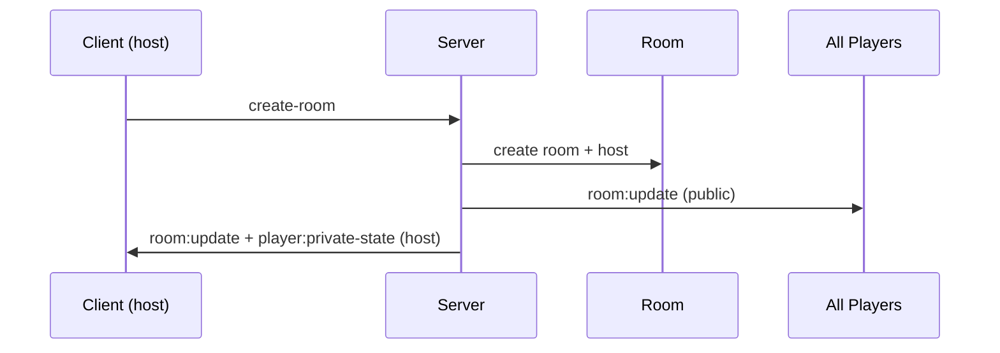

# Architecture Reference — Party Games

> Reference architecture for a real-time multiplayer online party / social-deduction game.
> Based on the current "Party Games" system plus common web-socket game architecture patterns.

---

## 1. System overview

### 1.1 What the system does

The game is a **mobile-first, real-time multiplayer** experience:

- One host creates a room; players join from their own phones using a room code or QR code.
- Players receive a secret role and hidden word; only the host/client with that role sees it.
- The game progresses through **server-authoritative phases**: lobby, game select, reveal, input,
  reveal-answers, discussion, vote, results, next-round.
- Real-time sync is delivered over WebSockets (Socket.IO), with public and private state masking.

### 1.2 Deployment shape of the current system

```text
Browser (player 1) ──┐
Browser (host)  ────├── Express + Socket.IO (port 3000, 0.0.0.0)
Browser (player N) ──┘
        │  HTTP(S)
        ▼
   Vite dev server (dev) / dist/ static (prod)
```

- **Development:** Express boots Vite in `middlewareMode: true` with `appType: 'spa'`.
- **Production:** Express serves `dist/` statically with a wildcard fallback to `index.html`.

### 1.3 Key design constraints inherited from the codebase

- Single port (`3000`) for HTTP and WebSocket traffic.
- Server maintains in-memory server state.
- Clients are mobile-first, max-width `480px`, touch-target-focused, dark/light/system theme.
- Secret data is **never** sent to the wrong client; the server masks it.

---

## 2. Architectural pillars

### 2.1 Server-authoritative state

The server is the source of truth for:

- Room creation and code generation.
- Player identity, scores, connection state, and tokens.
- Role assignment and hidden words.
- Phase transitions and timer expiry.
- Vote and clue submission validation.

Clients never invent game truth. They propose inputs; the server accepts/rejects them and
broadcasts the resulting state.

### 2.2 Public / private state separation

Two output channels exist:

1. **`room:update`** — broadcast to all players in the room with safe, masked public data (room
   code, player list, phase, public timers, revealed answers, public votes, standings).
2. **`player:private-state`** — targeted to a single player with secret role, hidden word, secret
   hint, input placeholder, and private submission state.

The public channel must never contain:

- Hidden words.
- Impostor role.
- Private instructions.
- Un-submitted secrets.

The private channel is only for the intended recipient.

### 2.3 Real-time transport

- Primary: **WebSockets**.
- Fallback: **HTTP long-polling** (Socket.IO `transports: ['websocket', 'polling']`).
- Transport should be selected by the client, but the server must handle reconnection gracefully
  when the transport changes.

### 2.4 Event-driven input, state-driven output

Clients emit commands; the server mutates state; the server emits state. This prevents clients
from diverging.

---

## 3. Socket.IO communication model

### 3.1 Core event flow



### 3.2 Key events and their roles

#### Authentication and identity

- `create-room` — host creates a room, receives `room`, `player`, and `privateState`.
- `join-room` — new player or reconnect by token/name.
- `reconnect` — explicit reconnect by previous name or session token.
- `disconnect` — client leaves; server marks player disconnected and promotes host if needed.

#### Room and game control

- `select-game` — host picks a game.
- `advance-phase` — host progresses the phase state machine.
- `submit-input` — player submits a clue or answer.
- `cast-vote` — player votes in the vote phase.
- `reset-to-lobby` — returns to lobby.
- `add-bot` — host adds a test player.

#### State sync

- `room:update` — full public room state.
- `player:private-state` — private state for one player.

### 3.3 Room scoping

Each Socket.IO socket joins the room by its **room code** (uppercase). The server uses
`io.to(roomCode)` for room broadcasts and per-player `socket.id` for private state.

### 3.4 Connection reliability

- Client reconnection: save room code, player id, session token, and player name.
- Server reconnect: match by session token first, then by displayed name.
- Reconnection should restore `connected` flags, room, phase, timers, and private state.

---

## 4. Room and match lifecycle

### 4.1 Room states

```text
idle (created, no players)
lobby
game-select
reveal
input
reveal-answers
discussion
vote
results
next-round
closed (idle timeout / host left)
```

### 4.2 Lifecycle steps

1. **Host creates room** → generates a unique 4-character code, creates a host player, sets phase
   to `lobby`.
2. **Players join** → validate code, cap at 12 players, assign color index (0–5), generate
   session token.
3. **Game select** → host picks the game.
4. **Reveal** → server assigns roles and hidden words; starts a reveal timer.
5. **Input** → players submit clues; server records them; starts an input timer.
6. **Reveal-answers** → compile revealed answers in random order; start timer.
7. **Discussion** → timed discussion.
8. **Vote** → record votes; start vote timer.
9. **Results** → calculate standings, reveal roles, award points.
10. **Next round** → increment round number, return to `reveal` with new secrets.

### 4.3 Timer model

- Timers live on the server.
- Each phase can define `durationSeconds` and an expiry callback that triggers the next phase.
- A phase timer should expose `remainingSeconds` and `durationSeconds` so the client can render
  the same countdown.
- Timers must be cleared on phase change, disconnect, or forced skip.

### 4.4 Bot / test player model

- Bots are injected by the host during `lobby` or `game-select`.
- Bots can simulate clues, submissions, and votes so the host can test a single machine.
- Bots are marked with an `isBot` flag and a `socketId: null` so they are not confused with
  real connections.

---

## 5. Phase state machine (recommended)

```text
lobby ──> game-select ──> reveal
   ▲          │            │
   │          ▼            ▼
   └──── input <── reveal-answers
                    │
                    ▼
                 discussion
                    │
                    ▼
                   vote
                    │
                    ▼
                 results
                    │
                    ▼
                 next-round ──> reveal
```

### 5.1 Phase responsibilities

| Phase           | Server owns                                            | Client shows                                   |
|-----------------|-------------------------------------------------------|------------------------------------------------|
| `lobby`         | room code, player list, start gate                    | QR code, room code, player chips, start       |
| `game-select`   | selected game id                                      | selectable game cards                          |
| `reveal`        | assigned role/word, secret instructions, reveal timer | hidden role screen, "keep screen hidden"       |
| `input`         | submitted answers, input timer                        | single-word clue input, submission status      |
| `reveal-answers`| randomized revealed answers, reveal timer             | rotating reveal cards                          |
| `discussion`    | discussion timer, visible clues                       | clue list, discussion prompt                   |
| `vote`          | vote tallies, vote timer                              | player vote grid, vote lock-in                 |
| `results`       | standings, role reveals, winner title                 | leaderboard, secret word/impostor reveal       |
| `next-round`    | restart reveal phase                                  | auto-advance to reveal                         |

---

## 6. Data model

### 6.1 Core entities

```text
Room
  code: string
  hostId: string
  players[]: Player
  phase: Phase
  selectedGame: GameMetadata | null
  roundNumber: number
  totalRounds: number
  timer: PhaseTimer | null
  phasePrompt: string
  phaseSubprompt?: string
  hasSubmittedInput: Set<string>
  hasVoted: Set<string>
  revealedAnswers: RevealedAnswer[]
  voteTallies: Record<string, number>
  playerVotes: Record<string, string>
  privateData: Record<string, PlayerPrivateState>
  results: PhaseResultsData | null
  createdAt: number
  lastActivityAt: number
```

### 6.2 Player

```text
Player
  id: string
  name: string
  colorIndex: number (0–5)
  colorHex: string
  colorName: string
  isHost: boolean
  connected: boolean
  score: number
  sessionToken: string
  joinedAt: number
  socketId: string | null
  isBot?: boolean
```

### 6.3 Private vs public split

```text
Public (broadcast to room)
  roomCode, hostId, players (no secrets), phase, selectedGame,
  roundNumber, totalRounds, timer, phasePrompt, phaseSubprompt,
  hasSubmittedInput, hasVoted, revealedAnswers, voteTallies, results

Private (per player)
  role, secretWord, secretHint, isSpecialRole, specialAccentBg,
  secretInstructions, inputPlaceholder, inputSubmitted,
  submittedAnswer, voteSubmitted, votedForPlayerId
```

---

## 7. Networked game mechanics

### 7.1 Compatibility and telemetry

- **Responsive design:** mobile-first, max-width `480px`, viewport meta.
- **Viewport handling:** `100dvh`, safe-area aware, `touch-action: manipulation`.
- **Fast input:** button taps use `minTouchTarget`, spring animations, `select-none`.
- **Offline/recovery:** session tokens and saved sessions for reconnect.
- **Broadcast sharing:** QR code, copy URL, share link, inline QR modal.

### 7.2 Voice, chat, and answer sanitization

For a full web-based party game, the same architecture should support:

- **In-app text chat** scoped to rooms (optional).
- **Voice/calling** (WebRTC SFU or peer-to-peer) scoped to a room.
- **Answer/word sanitization** on the server to enforce "one word" and block forbidden words.

The current codebase already uses:

- Web Audio (`sound.ts`) for notification effects.
- Haptic feedback (`navigator.vibrate`).
- `qrcode` for QR code generation.
- Canvas confetti for results celebration.

### 7.3 Conflict and anti-cheat rules

The engine should treat the client as untrusted. Concretely:

- All role/word/verdict data is server-owned.
- The server validates inputs and only applies legal transitions.
- Client-side hidden state is for **display only** and must not affect the result.
- For social deduction, the server should not leak the impostor until `results`.

---

## 8. Recommended architecture improvements

### 8.1 Persist room data

Use a database (Postgres, SQLite, or a managed NoSQL) so rooms survive restarts and players can
rejoin later.

Recommended schema concept:

```text
rooms:
  id, code, host_id, phase, selected_game_id,
  round_number, total_rounds, state_json, created_at, updated_at, deleted_at

players:
  id, room_id, session_token, name, color_index,
  connected, score, is_bot, joined_at, last_seen_at

votes / clues:
  id, room_id, player_id, type, payload, created_at
```

Keep `room.state_json` for fast reads and a separate **log table** for votes/clues if you need a
full replay.

### 8.2 Room scalability

- Use a **Socket.IO adapter** for multiple processes/instances so rooms can spread across
  pods.
- Keep room state in a shared store if you need cross-process consistency.
- Consider sharding by room code and using explicit room IDs instead of raw room-code
  broadcasting at scale.

### 8.3 Session and identity hardening

- Rotate session tokens after login/room creation.
- Store a short-lived auth handshake token plus a long-lived room session token.
- Validate `sessionToken` on every reconnect and reject stale/accidental tokens.
- Store no secrets in `localStorage` beyond session data; prefer memory-only tokens where
  possible.

### 8.4 Rate limits and abuse prevention

- Limit room creation rate per IP and per account.
- Limit submit/vote actions per player per second.
- Enforce max players per room and per game.
- Add a room idle timeout to free orphaned rooms.
- Use a circuit breaker for external resources (AI, confetti, analytics) so broken
  integrations don't take down gameplay.

### 8.5 Observability

- Structured logs for: connection, room create/join/leave, phase transitions, input submit,
  vote cast, errors, reconnects.
- Metrics: active rooms, players per room, reconnect rate, latency, error rate.
- Distributed tracing for Socket.IO endpoints and any AI/NLP calls.

### 8.6 Testing

- Unit tests for room state machine transitions and validations.
- Integration tests over Socket.IO: create room, join, submit, vote, results, reconnect.
- Fixture-based bot simulation to exercise edge cases (timeout, disconnect, full room).
- Snapshot/UI tests for each phase.

### 8.7 CI/CD

- Type-check (`tsc --noEmit`).
- Lint.
- Build for client and server.
- Start the server, boot the client, and run a smoke test with an HTTP health endpoint and a
  Socket.IO handshake.
- Run the full test suite before deployment.

---

## 9. Hosting and delivery notes

### 9.1 Frontend

- React 19, TypeScript, Tailwind CSS v4, Vite.
- Deploy as a static SPA to any static host (Cloud Run, Cloudflare Pages, Vercel, AWS S3 + CDN).
- Mirror `index.html` and assets; handle SPA fallback to `index.html`.

### 9.2 Backend

- Node.js, Express, Socket.IO.
- Bundle with esbuild to `dist/server.cjs` for production.
- Bind to `0.0.0.0:3000` behind a reverse proxy/LB.
- Set `NODE_ENV=production` to enable static serving and production safety checks.

### 9.3 Environment variables

- `PORT` (default `3000`).
- `NODE_ENV=production`.
- `DISABLE_HMR=true` for development when file watching is undesirable.
- Real secrets for any external services (Gemini API, analytics, auth) should be injected by the
  hosting environment, not committed.

---

## 10. Summary checklist

Use this checklist when generating or reviewing a game architecture:

- [ ] Server-authoritative state
- [ ] Public/private state separation
- [ ] Room/player lifecycle with idempotent rejoin
- [ ] Socket.IO event contract
- [ ] Server-driven phase state machine and timers
- [ ] Input validation and anti-cheat
- [ ] Persistence strategy
- [ ] Rate limiting and resource limits
- [ ] Observability
- [ ] Testing and CI
- [ ] Mobile-first UI with touch targets
- [ ] Hosting/deployment configuration

---

*The current implementation is a strong starting point: it already models these pillars in a
single-process Express + Socket.IO server. The remaining work is hardening: persistence, scaling,
rate limits, formal reconnect handling, and production observability.*
